# CanGo — Learn Italian for Real Life

**CanGo** is a modern, AI-powered Progressive Web App (PWA) that teaches
Italian through realistic, scenario-based conversations. Built on a
modern AI stack — Next.js 16, TypeScript, Tailwind CSS v4, Drizzle ORM,
NextAuth.js, and Supabase — with offline-first support via IndexedDB and
speech synthesis for authentic pronunciation practice.

- **Prototype:** [Prototype by Google Stitch](https://stitch.withgoogle.com/preview/205405448292237550?node-id=88c0e749cfc44e6ebd7d17ce16426edb)
- **PRD:** [PRD.md](./PRD.md)


## Built With

- **AI Coding Assistant:** Opencode, Antigravity
- **AI Models:** DeepSeek, Gemini, Groq
- **AI SDK:** Vercel AI SDK
- **Prototyping:** Google Stitch
- **Image Generation:** Nano Banana


## Tech Stack

- Next.js 16, TypeScript, Tailwind CSS v4
- Drizzle ORM + Supabase Postgres
- NextAuth.js v5 (Credentials provider)
- Dexie.js (offline IndexedDB cache)
- Vitest (unit/integration), Playwright (E2E)
- Web Speech API / edge-tts (audio)
- Web Speech API (SpeechRecognition)
- PWA (manifest, service worker)


## Features

- Real-world scenarios: transportation, doctor visits, job interviews, restaurant, shopping, social
- Adaptive CEFR levels (A2 → B1 → B2), with per-scenario level settings
- Interactive challenges: MCQs, matching, dialogue ordering, best-response
- AI tutor chatbot with streaming responses — adapts to your CEFR level per scenario
- Roleplay mode: pick any character from the dialogue and converse with the AI
- Speech recognition (mic input) for Italian speaking practice
- Text-to-speech in Italian and German with playback controls
- Collapsible translations — view meanings on demand without clutter
- Personalized practice suggestions based on completed experiences and CEFR
- PWA: installable with offline support via service worker
- Streak tracking and XP rewards
- Supabase + NextAuth credentials authentication
- **Beta access gate**: free access codes, email lead capture, and instant code delivery by email
- **Progress dashboard** at `/progress` — XP, streaks, today's goal, 7-day activity, per-scenario progress
- **Tip jar**: optional Ko-fi / coffee link on the profile page
- **AI observability** via Langfuse (optional, off by default)

---

## Setup

### 1. Environment Variables

```bash
cp .env.local .env
```

Fill in your Supabase credentials in `.env`:

- `DATABASE_URL` — Postgres connection string (Supabase)
- `AUTH_SECRET` — Generate with `npx auth secret`
- `AUTH_URL` — `http://localhost:3000`

The app supports a second (e.g. German) deployment via `APP_LANG=de`. All
env vars have `_DE`-suffixed variants (`DATABASE_URL_DE`, `AUTH_SECRET_DE`,
`NEXT_PUBLIC_SUPABASE_URL_DE`, etc.) that are used when `APP_LANG=de`.

**Beta access** (all optional — codes are required by default):

- `BETA_CODE_REQUIRED` / `NEXT_PUBLIC_BETA_CODE_REQUIRED` — set to `false`
  to disable the access-code gate entirely (default `true`)
- `RESEND_API_KEY` — enables instant email delivery of access codes
  (no key = the code is shown on-screen instead of emailed)
- `EMAIL_FROM` — sender address, e.g. `CanGo <beta@yourdomain.com>`
- `BETA_MAX_PER_IP` — max new code requests per IP per day (default `3`)
- `BETA_DAILY_LIMIT` — max new code requests per day (default `90`, safely
  under Resend's 100/day free tier)

**Other optional vars:**

- `NEXT_PUBLIC_DAILY_GOAL_XP` — progress page daily goal (default `50`)
- `NEXT_PUBLIC_COFFEE_URL` — Ko-fi/PayPal link shown on the profile page
  (hidden when unset)

### 2. Install Dependencies

```bash
npm install
```

### 3. Push Database Schema

```bash
npm run db:push
```

### 4. Seed Content Data

```bash
npm run seed
```

> The seed script is idempotent — it can be run multiple times without errors.
> Existing experiences are updated in place, preserving user progress data.

### 5. Generate Audio (Optional)

```bash
bash scripts/generate-audio.sh
```

### 6. Run Dev Server

```bash
npm run dev
```

Open [http://localhost:3000](http://localhost:3000).

## Deployment

- **Production** — `main` branch auto-deploys to Vercel production
- **Development** — `dev` branch auto-deploys to Vercel preview
- Environment variables configured in Vercel project dashboard

## Testing

```bash
# Unit & integration tests
npm test

# E2E tests (requires a test user — sign up at /auth first)
npm run test:e2e

# E2E tests with visible browser (headed mode)
npm run test:e2e -- --headed

# E2E interactive UI debugger
npm run test:e2e -- --ui
```

> E2E tests use Playwright with Chromium. Update credentials in `e2e/auth.setup.ts` to match your test account.

## Auth

- Sign up / Log in with email + password via `/auth`
- Credentials are stored in Supabase `users` table with bcrypt-hashed passwords
- Protected routes redirect to `/auth` if unauthenticated
- Signup requires a beta access code by default (see Beta Access below)
- The `/auth` page confirms the session before navigating after login/signup to
  avoid a middleware redirect loop

## Beta Access

CanGo is gated by free access codes during beta. The flow:

1. A new user signs up at `/auth` with an **access code** (0€).
   Codes are unlimited-use and shared — generate them with:
   ```bash
   npm run gen:code -- my-code-1 my-code-2   # targets the APP_LANG DB
   npm run gen:code:it                       # explicitly targets the Italian DB
   ```
2. No code? The "Don't have a code yet?" box captures an email lead
   (`beta_requests` table). With `RESEND_API_KEY` configured, each request
   **instantly receives a fresh unique code by email** (e.g. `cango-x7k2m9`)
   and `code_sent_at` is stamped. Without a key, the **code is shown directly
   on-screen** (plain text) so the flow still works with zero email setup.

**Spam protection** (highlighted, built-in):

- **Per-IP cap** — max `BETA_MAX_PER_IP` (default 3) new requests per IP per
  day → HTTP 429
- **Global daily cap** — max `BETA_DAILY_LIMIT` (default 90) new requests per
  day → HTTP 429 (stays under Resend's free-tier 100/day)
- **Email dedupe** — each email can request once; repeats get a friendly
  "we already have your email" reply

Under the hood: codes live in `beta_codes`, requests in `beta_requests`.
`/api/beta/verify` and `/api/beta/request` are exempt from the auth middleware
so they work before login. To disable the gate entirely set
`BETA_CODE_REQUIRED=false` and `NEXT_PUBLIC_BETA_CODE_REQUIRED=false`.

## AI Observability (Langfuse)

AI tutor chats can be traced with Langfuse via OpenTelemetry. To enable: sign
up at `cloud.langfuse.com`, create a project, then set `LANGFUSE_PUBLIC_KEY`,
`LANGFUSE_SECRET_KEY`, `LANGFUSE_BASE_URL` in `.env`. Tracing is a **no-op
when the keys are absent** — dev and tests are unaffected. See `AGENTS.md` for
details.

## Screenshots

| View | Mobile | Desktop |
|------|--------|---------|
| **Landing Page** |  |  |
| **Onboarding Welcome** | 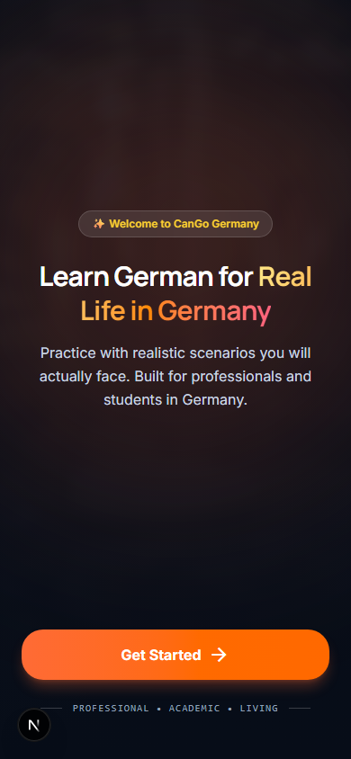 |  |
| **Level Selection** | 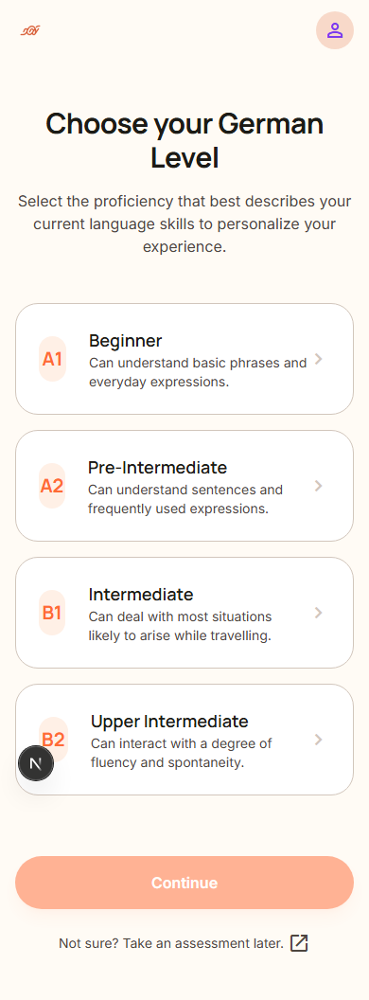 |  |
| **Goals Selection** | 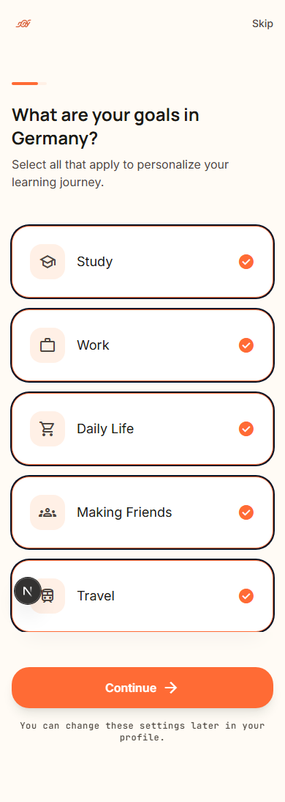 | 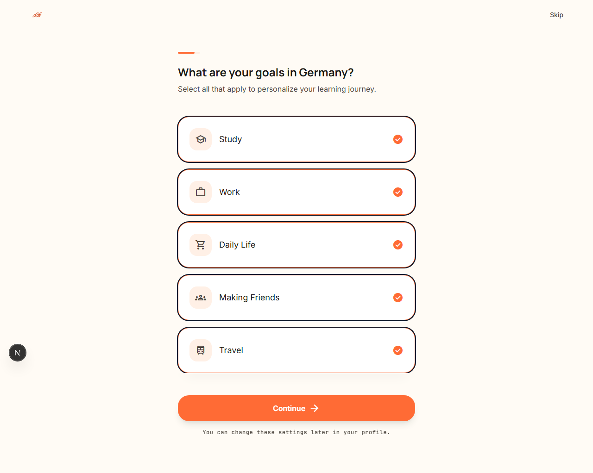 |
| **Main Dashboard** | 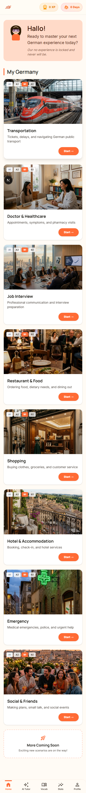 | 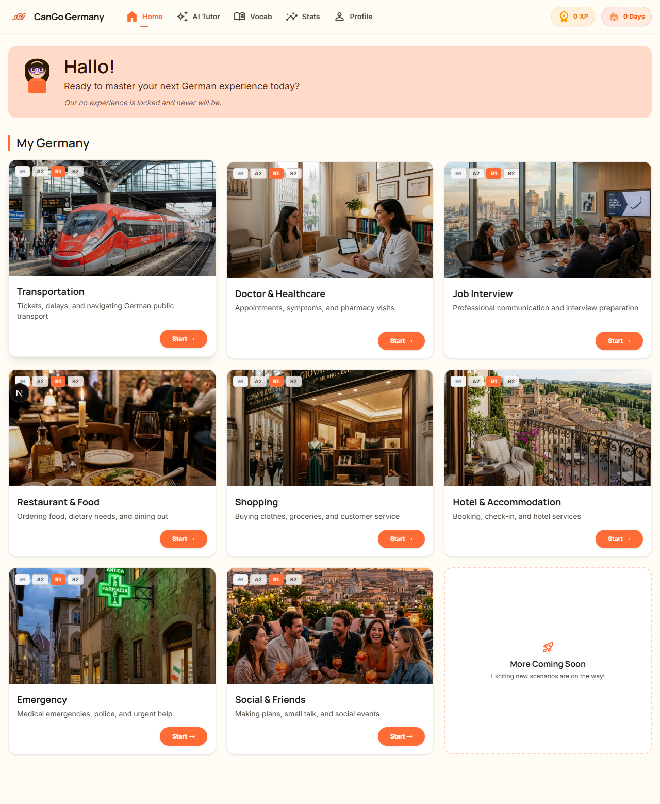 |
| **Scenario Overview** | 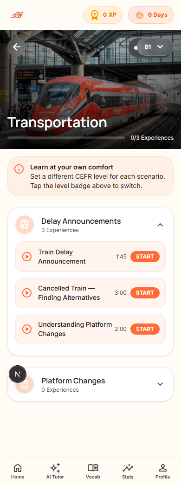 | 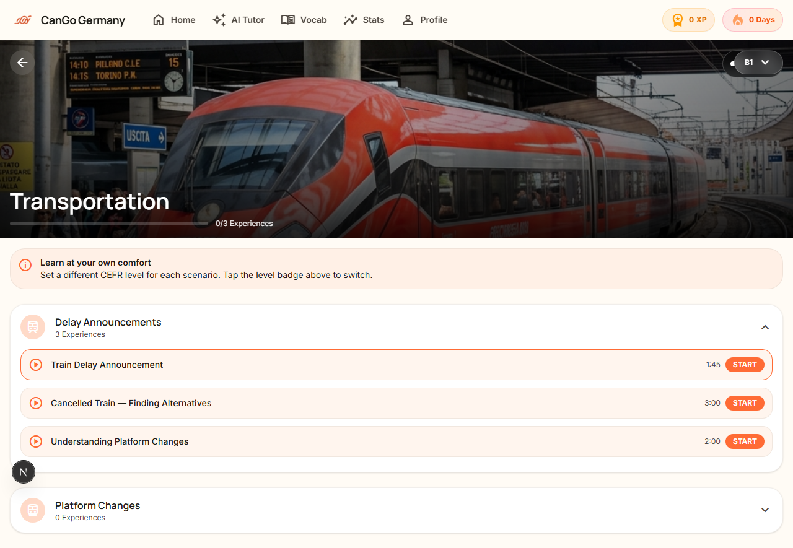 |
| **Experience Player (AI Tutor)** | 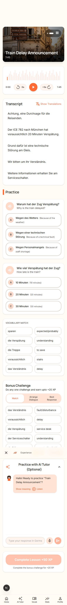 | 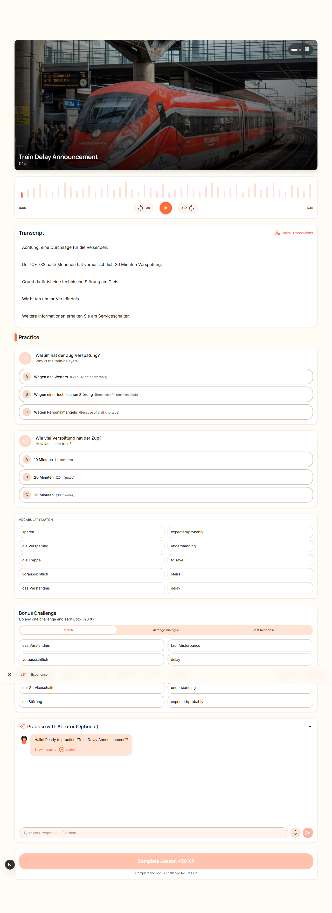 |
| **Stats & Progress** | 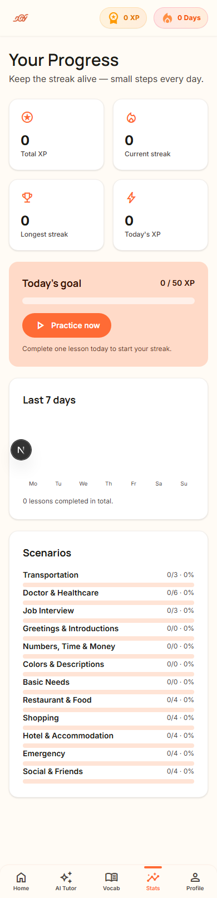 | 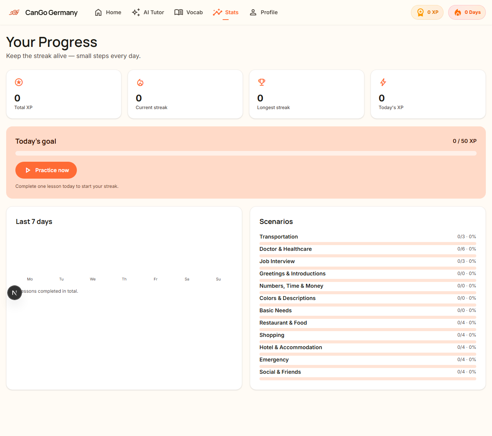 |
| **Profile & Tip Jar** | 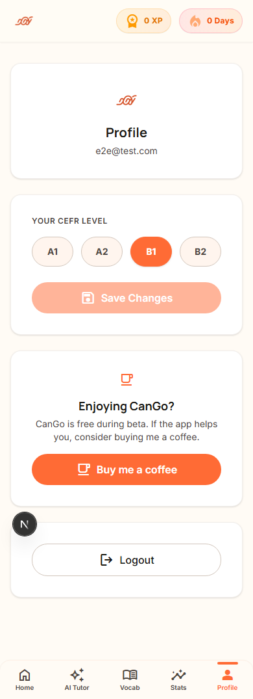 | 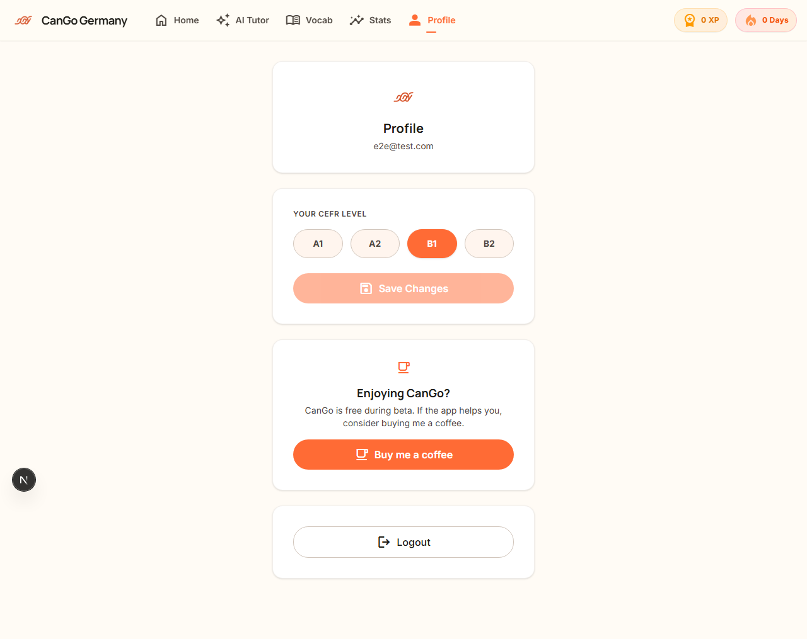 |
| **AI Tutor** | 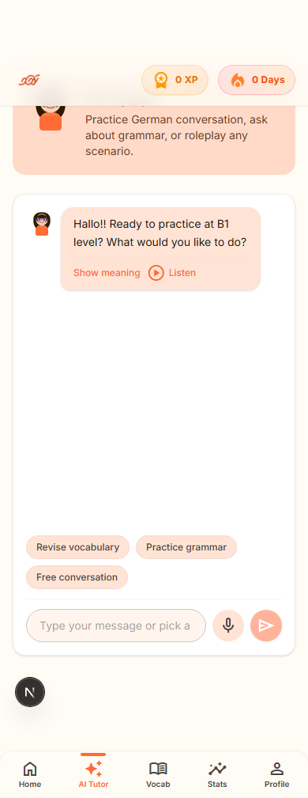 | 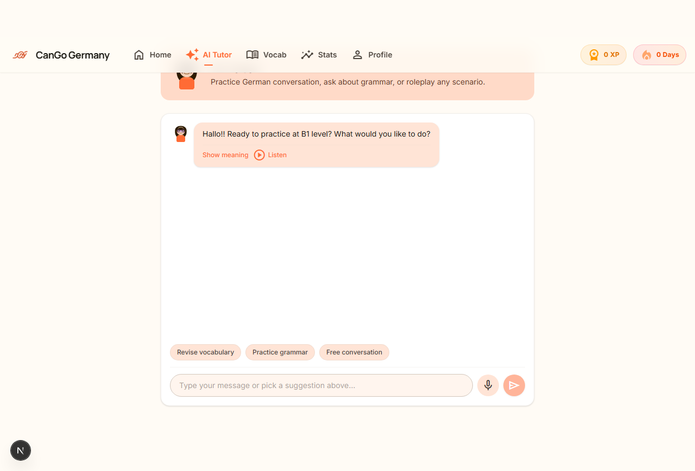 |
| **Vocabulary Kanban** | 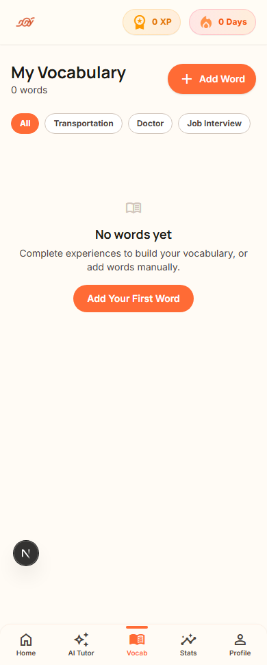 | 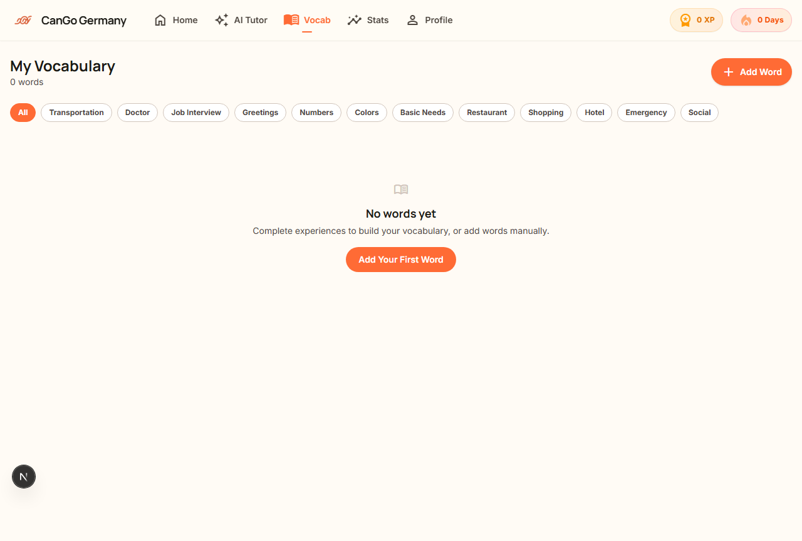 |
